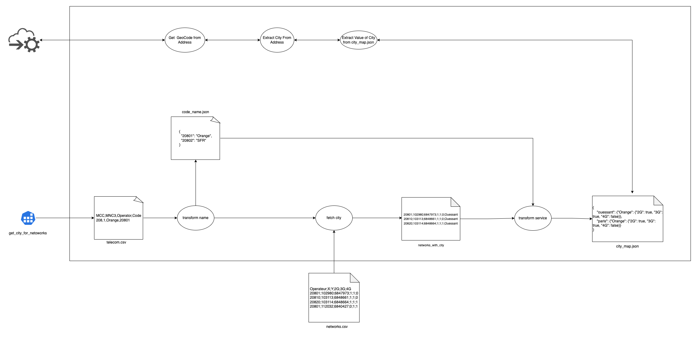

## Table of Contents
1. [Architecture Diagram](#architecture-diagram)
2. [How to Run Application](#run-application)
3. [Run Test Cases](#run-test-cases)
4. [Background Job](#background-job)
5. [Monitor Background Task](#monitor-background-task)
6. [API](#service-discovery)


### Architecture Diagram


### How to Run Application
1. [Install Requirements](#install-requirements)
2. [Setup Redis](#setup-redis)
3. [Run Application](#run-application)

#### Install Requirements

```shell
   pip install -r requirements.txt
   ```

#### Setup Redis

1. Install Redis in Mac
```shell
brew install redis
```
2. Start Redis Service
```shell
brew services start redis
```
3. Start Redis Service
```shell
redis-server
```
4. Redis Worker
Start redis worker from project directory as:
```shell
rq worker --with-scheduler
```

#### Run Application
```shell
python app.py
```
### Run Test Cases
Navigate to the project directory and execute command
```shell
pytest
```

### Monitor Background Task
[Redis Dashboard](http://127.0.0.1:5000/rq)

### Service Discovery
#### Find Available Network
```
Request
-------------------------------
Method: GET
URL: /discover?q=Vitry-sur-Seine

Response, 200
-------------------------------
{
	"SFR": {
		"2G": false,
		"3G": true,
		"4G": true
	},
	"Orange": {
		"2G": true,
		"3G": true,
		"4G": true
	},
	"Free mobile": {
		"2G": false,
		"3G": true,
		"4G": true
	},
	"Bouygues Telecom": {
		"2G": true,
		"3G": false,
		"4G": false
	}
}
```

### Background Job
This background jobs extracts data and generates necessary files to discover the available networks on respective location.
Redis worker must run before starting this job. 

```
Request
-------------------------------
Method: GET
URL: /extract

Response, 200
-------------------------------
{
	"message": "job initiated to fetch city for networks"
}
```

### Issues
Couldn't get the address detail for 50% of the lambert coordinates from api ```https://api-adresse.data.gouv.fr/search```.

